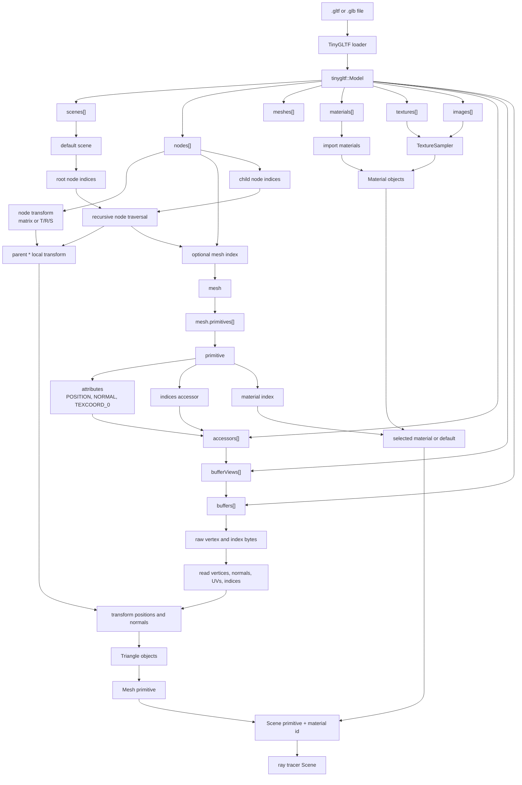

# glTF Scene Structure and Texture Mapping Diagrams

## glTF Scene Structure and Import Flow



Teaching notes:

- A glTF scene is not a flat list of triangles. It is a graph-like hierarchy: scenes point to root nodes, nodes point to child nodes and optional meshes.
- Mesh data is indirect. A primitive refers to accessors; accessors describe how to read typed values from buffer views; buffer views point into raw binary buffers.
- Importing resolves those references into the renderer's own data: transformed triangles, material records, texture samplers, and scene primitives.
- In this project, only triangle primitives are imported. Missing normals are replaced with face normals, and missing UVs become `(0, 0)`.

## Texture Mapping Flow

```mermaid
flowchart LR
  triangle["3D triangle<br/>positions P0, P1, P2"] --> hit["ray hit point"]
  uvVerts["per-vertex UVs<br/>UV0, UV1, UV2"] --> interpolate["barycentric interpolation"]
  hit --> bary["barycentric weights<br/>w0, w1, w2"]
  bary --> interpolate
  interpolate --> uv["surface UV<br/>UV = w0*UV0 + w1*UV1 + w2*UV2"]

  uv --> wrap["apply wrap mode"]
  wrap --> repeat["Repeat<br/>fractional part"]
  wrap --> clamp["Clamp to edge<br/>limit to 0..1"]
  wrap --> mirror["Mirrored repeat<br/>alternate direction"]

  repeat --> wrappedUV["wrapped UV"]
  clamp --> wrappedUV
  mirror --> wrappedUV

  image["2D texture image<br/>pixels/texels"] --> lookup["convert UV to texel position"]
  wrappedUV --> lookup

  lookup --> filter{"filter mode"}
  filter --> nearest["Nearest<br/>pick one texel"]
  filter --> linear["Linear<br/>blend four neighboring texels"]

  nearest --> sampledColor["sampled texture color"]
  linear --> sampledColor

  baseFactor["material base color factor"] --> combine["combine with material values"]
  sampledColor --> combine
  combine --> final["surface color used by shading"]
```

Teaching notes:

- Geometry stores UV coordinates at vertices. The renderer interpolates those UVs across the triangle at the ray hit point.
- UV coordinates are normalized texture coordinates, usually from `0` to `1`, not pixel coordinates.
- Wrap mode decides what happens when UVs fall outside `0..1`.
- Filter mode decides how the image is sampled between texel centers.
- A texture usually modulates a material value. In this project, the albedo texture is multiplied by the material albedo factor.
